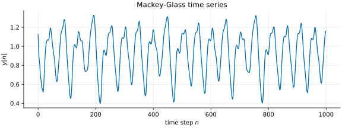
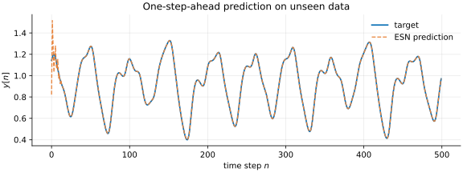

===============
Getting started
===============

Before going further, please make sure that you have installed **PyRCN** as
described in the :ref:`installation guide`, ideally in a fresh virtual
environment.

PyRCN is an open-source project that aims to make it easy and transparent to
build Reservoir Computing Networks (RCNs). To learn more about the theory behind
it, see :ref:`whats rc`.

Building an Echo State Network
==============================

An Echo State Network is created with a single command, using the
:py:class:`pyrcn.echo_state_network.ESNRegressor` (for regression) or
:py:class:`pyrcn.echo_state_network.ESNClassifier` (for classification) class:

.. doctest::

    >>> from pyrcn.echo_state_network import ESNRegressor
    >>> esn = ESNRegressor()
    >>> esn
    ESNRegressor(input_to_node=InputToNode(), node_to_node=NodeToNode(),
                 regressor=IncrementalRegression())

As we can see, the ``esn`` is composed of several building blocks:
:py:class:`pyrcn.base.blocks.InputToNode` connects the input features to the
reservoir neurons, :py:class:`pyrcn.base.blocks.NodeToNode` defines the
recurrent connections inside the reservoir, and
:py:class:`pyrcn.linear_model.IncrementalRegression` is the trained readout. By
default, the input and reservoir connections are randomly initialized and then
kept fixed.

The building blocks can be customized and swapped. The module
:py:mod:`pyrcn.base.blocks` offers several ready-made variants:

.. doctest::

    >>> import pyrcn.base.blocks as blocks
    >>> from inspect import getmembers, isclass
    >>> sorted(name for name, _ in getmembers(blocks, isclass))
    ['BatchIntrinsicPlasticity', 'EulerNodeToNode', 'HebbianNodeToNode',
     'InputToNode', 'NodeToNode', 'PredefinedWeightsInputToNode',
     'PredefinedWeightsNodeToNode']

Have a look at their documentation and at the examples to see how they are used.

Training on a time series
=========================

RCNs can be trained on many kinds of data. Echo State Networks are especially
well suited to sequential data such as time series. As a demonstration, PyRCN
ships the Mackey-Glass time series, a common benchmark for ESNs:

.. doctest::

    >>> from pyrcn.datasets import mackey_glass
    >>> X, y = mackey_glass(n_timesteps=8000)

Plotting it shows a quasi-periodic, chaotic signal:

We use the ESN for a one-step-ahead prediction of this time series. Training
takes three conceptual steps:

1. Randomly project the input into the reservoir neurons (**Input-to-Node**).
2. Update the state of each neuron from the current input and the previous state
   (**Node-to-Node**).
3. Fit a linear readout from the reservoir states to the target
   (**Node-to-Output**).

All three are handled by
:py:meth:`pyrcn.echo_state_network.ESNRegressor.fit`. We train on the first half
of the series:

.. doctest::

    >>> esn.fit(X[:4000].reshape(-1, 1), y[:4000])
    ESNRegressor(input_to_node=InputToNode(), node_to_node=NodeToNode(),
                 regressor=IncrementalRegression(), requires_sequence=False)

The ESN is fitted with a single command and is ready to use.

Predicting on unseen data
=========================

We now use :py:meth:`pyrcn.echo_state_network.ESNRegressor.predict` to predict
the second, unseen half of the series:

.. doctest::

    >>> y_pred = esn.predict(X[4000:].reshape(-1, 1))
    >>> y_pred.shape
    (4000,)

The prediction closely follows the target signal:

Training the readout with gradient descent
==========================================

By default, the readout is trained in closed form by (regularized) linear
regression. PyRCN can instead train it iteratively with a gradient-based
optimizer, which is selected with ``solver="gradient"``. The reservoir stays
fixed, and the readout is optimized over several ``epochs``:

.. doctest::

    >>> esn_grad = ESNRegressor(solver="gradient", epochs=50,
    ...                         learning_rate=0.01)
    >>> esn_grad.fit(X[:4000].reshape(-1, 1), y[:4000])
    ESNRegressor(epochs=50, input_to_node=InputToNode(), learning_rate=0.01,
                 node_to_node=NodeToNode(), regressor=IncrementalRegression(),
                 requires_sequence=False, solver='gradient')
    >>> y_grad = esn_grad.predict(X[4000:].reshape(-1, 1))
    >>> y_grad.shape
    (4000,)

The optimizer (for example ``"adam"`` or ``"sgd"``), the ``learning_rate`` and
the number of ``epochs`` can all be configured. The gradient solver is also the
basis for making the input and reservoir weights trainable, via
``trainable_input=True`` and ``trainable_reservoir=True``.
