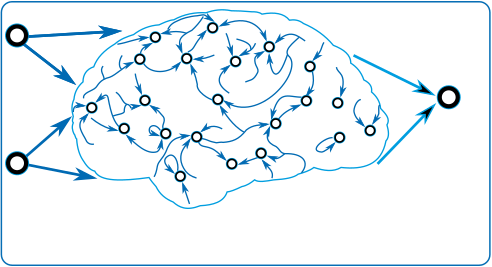

.. _whats rc:

===================================
Introduction to Reservoir Computing
===================================

Reservoir Computing (RC) is a family of machine learning methods for the fast,
one-shot training of Recurrent Neural Networks (RNNs). The central idea is to
project the input nonlinearly into a high-dimensional state space using random,
fixed connections, and then to solve the actual task with a simple linear model
on top of that state. Because only this final linear layer is trained, usually
by regularized linear regression, training is fast and stable and avoids the
iterative optimization of a fully trained RNN.

The best known RC architecture is the Echo State Network (ESN), introduced by
Herbert Jaeger. The `Scholarpedia article about Echo State Networks
<http://www.scholarpedia.org/article/Echo_state_network>`_ gives an excellent
introduction to the topic.

   Schematic overview of an Echo State Network: a fixed random input layer
   feeds a recurrent reservoir, and only the linear readout is trained.

Echo State Networks
===================

An ESN maps a sequence of inputs :math:`u[n]` to a sequence of reservoir states
:math:`r[n]`. The reservoir is a pool of neurons with fixed, random recurrent
connections. With leaky integration, the state is updated at each time step as

.. math::

   r[n] = (1 - \lambda)\, r[n-1]
          + \lambda\, f\!\left(W^{\mathrm{in}}\, u[n] + W^{\mathrm{res}}\, r[n-1]\right),

where

* :math:`W^{\mathrm{in}}` is the fixed, randomly initialized input weight matrix,
* :math:`W^{\mathrm{res}}` is the fixed, randomly initialized recurrent weight
  matrix of the reservoir,
* :math:`f(\cdot)` is a nonlinear activation function, typically
  :math:`\tanh`,
* :math:`\lambda \in (0, 1]` is the leakage, which acts as a first-order lowpass
  filter on the state (a value of :math:`1` recovers the non-leaky update).

The recurrent matrix :math:`W^{\mathrm{res}}` is rescaled so that its largest
absolute eigenvalue equals a chosen spectral radius :math:`\rho`, usually close
to or below :math:`1`. This encourages the Echo State Property, under which the
influence of past inputs and initial conditions gradually fades, so that the
reservoir state is effectively a function of the recent input history.

The output is a linear readout of the reservoir state,

.. math::

   y[n] = W^{\mathrm{out}}\, r[n],

and the readout weights :math:`W^{\mathrm{out}}` are the only trained
parameters. They are obtained by (regularized) linear regression between the
collected reservoir states and the target outputs. PyRCN also offers an
iterative, gradient-based alternative and the option to make the input and
reservoir weights trainable; see :doc:`getting_started`.

Extreme Learning Machines
=========================

In a broader sense, the Extreme Learning Machine (ELM), introduced by Guang-Bin
Huang, also belongs to Reservoir Computing, even though it is a feed-forward
network without recurrent connections. It applies a fixed, random nonlinear
projection of the input followed directly by a trained linear readout. The
training paradigm, a random fixed projection with a linear output layer, is the
same as for the ESN, and PyRCN unifies the development of ESNs and ELMs under a
single, consistent API.

Further reading
===============

For a detailed treatment of the architectures, their hyperparameters and the
design of PyRCN, please refer to the accompanying journal article (see
:doc:`citation`; a preprint is available at
`arXiv:2103.04807 <https://arxiv.org/abs/2103.04807>`_).

Many worked examples are available in the `PyRCN repository
<https://github.com/PlasmaControl/PyRCN/tree/main/examples>`_ as Jupyter
notebooks and Python scripts.

PyRCN is loosely inspired by `ReservoirPy
<https://github.com/reservoirpy>`_, another Reservoir Computing toolbox with a
different scope. We recommend having a look at their examples and tutorials as
well.
